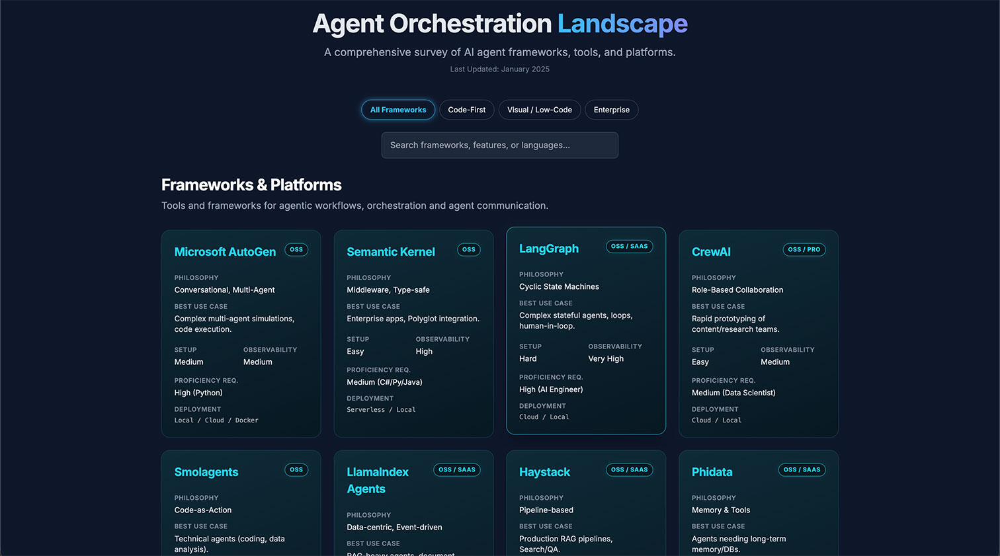

# Agent Orchestration Landscape | 2025 Survey

## Overview

This repository hosts a comprehensive, interactive survey of the AI agent orchestration landscape as of early 2025. It serves as a centralized resource for developers, researchers, and enterprises to explore the rapidly evolving ecosystem of agent frameworks, benchmarking tools, and datasets.

The project features a responsive web interface that categorizes tools into key segments:
*   **Code-First Frameworks:** Libraries designed for developers building complex, multi-agent systems (e.g., LangGraph, AutoGen).
*   **Visual / Low-Code Platforms:** Tools enabling non-technical users to design agent workflows (e.g., n8n, Flowise).
*   **Enterprise Solutions:** Managed services focusing on security, scale, and compliance (e.g., Azure AI Agent Service).
*   **Benchmarking Ecosystem:** Essential utilities for evaluating agent performance, reliability, and safety.

## Goals

*   **Clarity:** Demystify the crowded agentic AI market by providing clear, standardized comparisons.
*   **Discovery:** Help teams identify the right tools for their specific proficiency levels and use cases.
*   **Education:** Highlight emerging methodologies for agent evaluation and testing.

## Contributing

We welcome contributions from the community to keep this landscape accurate and up-to-date.

### How to Contribute
1.  **Add a Framework:** If a tool is missing, please submit a Pull Request adding it to the `rawData` array in `index.html`. Ensure all fields (philosophy, proficiency, setup, etc.) are completed.
2.  **Update Data:** Correct outdated information regarding features, pricing models, or documentation links.
3.  **Enhance the UI:** Improvements to the visualization, filtering logic, or design are encouraged.

Please ensure all submissions adhere to the existing code style and structure.

## License

This project is open-source and available under the MIT License.
